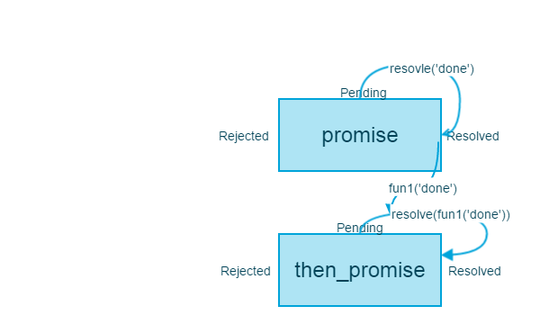
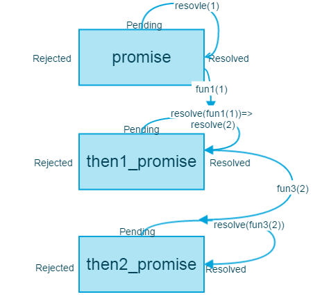
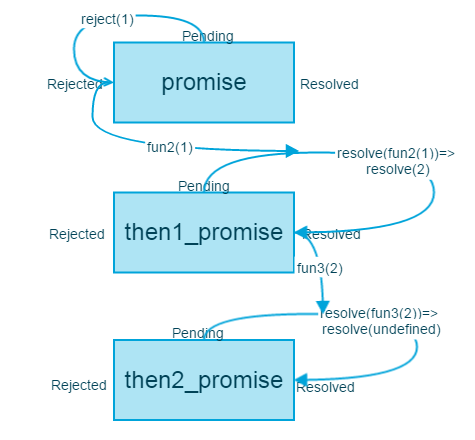
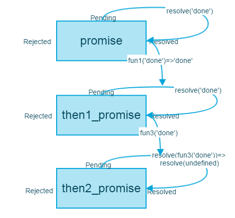
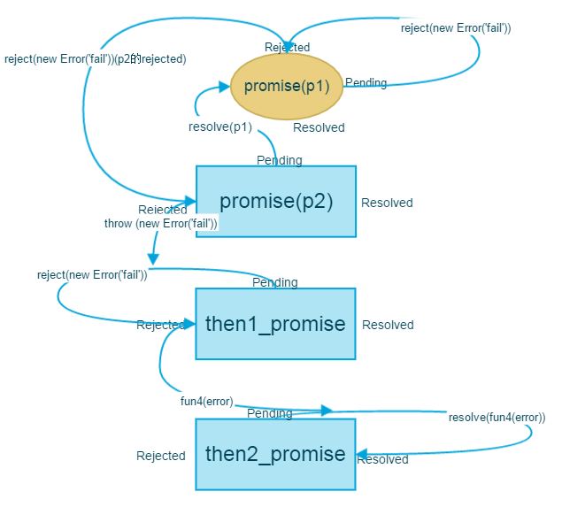
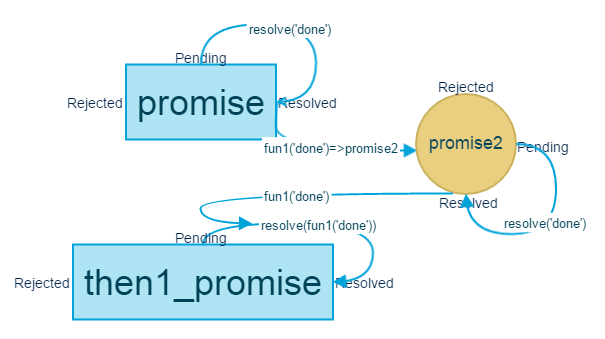

#如何实现Promise

## 理解Promise的使用
先要理解Promise如何使用，才能正确的实现Promise。

Promise实例有3种状态，'Pending'（进行中），'Resolved'(已完成)，'Rejected'（已失败）。Promise作为一个构造函数，接收一个函数作为参数。
    
```
var promise = new Promise(function(resolve,reject){
    //..resolve(value)/reject(error)
});
```
函数参数接收两个函数作为参数。（这2个参数由js引擎提供，不需要自己的定义）

resolve函数使得promise的状态从'Pending'装化为'Resolved',reject函数使得promise的状态从'resolve'装化为'reject'。除此之外，这2个函数，还将传递相应的参数出去。

**then方法**

Promise实例具有then方法，是Promise最重要的实例方法

```
new Promise(function(resolve,reject){
    //..resolve(value)/reject(error)
}).then(fun1,fun2)
```
then方法最多可以添加2个函数，fun1（可选是resolve的回调函数，接收resolve(value)中的value作为参数，fun2（可选）是reject的回调函数，接收reject(error)中的error作为参数，或者当构造函数的函数参数执行错误时，抛出的错误为参数。

```
eg1
function timeout(ms) {
  return new Promise((resolve, reject) => {
    setTimeout(resolve, ms, 'done');
  });
}

timeout(100).then((value) => {
  console.log(value);
});
// done

eg2
function timeout(ms) {
 return new Promise((resolve, reject) => {
    throw new Error('test');
    resolve(1);
  });
}
timeout(100).then((value) => {
  console.log('resolve:'+value);
},(value) => {
  console.log('reject:'+value);
});
//reject:Error: test

```

then方法中的第一个函数接收了来自resolve('done')的'done',执行函数，显示 done

then方法返回了一个新的promise实例，因此支持链式调用

```
promise.then(fun1,fun2).then(fun3,fun4)
```
第二个then方法中的fun3,fun4,根据第一个then返回的promise对象的状态进行调用,函数参数由fun1,fun2返回


```
eg3
var promise = new Promise(function (resolve, reject) {
  setTimeout(() => resolve(1), 1000)
}); 
promise.then((val)=>{return val+1})
.then((val)=>{console.log(val)});
//2

eg4
var promise = new Promise(function (resolve, reject) {
  setTimeout(() => reject(1), 1000)
}); 
promise.then(null,(val)=>{return val+1})
.then((val)=>{console.log('resolve:'+val)},(val)=>{'reject:'+console.log(val)});
//resolve:2

eg5
var promise = new Promise(function (resolve, reject) {
  setTimeout(() => reject(1), 1000)
}); 
promise.then(null,(val)=>{throw new Error('test') ;return val+1})
.then((val)=>{console.log('resolve:'+val)},(val)=>{'reject:'+console.log(val)});
//Error: test(…)
```
在eg4中，在第一个then方法中，第二个函数参数(val)=>{return val+1}被执行,在第2个then方法中，
第一个函数参数被执行；在eg5中，在第一个then方法中，第二个函数参数被执行,在第2个then方法中，
同样是第2参数被执行；

由此可以知道：then函数返回的函数状态是Resolved还是Rejected，与前一个函数的状态无关，与调用函数有关，
当调用函数抛出错误时，状态为Rejected。

then方法还可以不传入任何参数，此时，由Promise实例传出的参数，将由下一个then函数接收。

```
eg6
function timeout(ms) {
  return new Promise((resolve, reject) => {
    setTimeout(resolve, ms, 'done');
  });
}

timeout(100).then().then((value) => {
  console.log(value);
});
//done
```


**catch方法**实际上等于then(null,fun),不作赘述。


**注1**: Promise对象与事件不同，即使添加then方法的时候，函数状态已经变化,还是会立即执行函数

```
eg7
var promise = new Promise(function(resolve, reject) {
  console.log('Promise');
  reject('error');
});
promise.then(null,function(val){
    console.log(val);
});
//error
```

**注2**: then方法中的函数参数是异步任务

```
eg8
var promise = new Promise(function(resolve, reject) {
  console.log('Promise');
  resolve();
});

promise.then(function() {
  console.log('Resolved.');
});

console.log('Hi!');

// Promise
// Hi!
// Resolved
```

可以看到，promise赋值时，Promise中的函数参数直接执行，显示了'Promise'，然后resovle()执行后，then的函数参数没有执行，而是当所有同步任务执行完之后才会执行。

**注3**: resolve的参数可能是promise对象


```
eg9
var p1 = new Promise(function (resolve, reject) {
  setTimeout(() => reject(new Error('fail')), 3000)
})

var p2 = new Promise(function (resolve, reject) {
  setTimeout(() => resolve(p1), 1000)
})

p2
  .then(result => console.log(result))
  .catch(error => console.log(error))
  
  // Error: fail
```
由于resolve(p1),后面then方法何时执行，将取决于p1。

## 实现Promise
**注意**: 以下promise为Promise实例

首先实现一个最简单的Promise函数结构，总体的思想是将then中的2个方法存到2个数组中，当resolve/reject函数执行时，promise状态改变，数组被推出来执行

```
function Promise(callback) {

        var _this = this;
        this.PromiseStatus = 'Pending';
        this.resolve_array = [];
        this.reject_array = [];
        var resolve, reject;
        resolve = function(val) {
            if (_this.PromiseStatus === 'Pending') {
                _this.PromiseStatus = 'Resolved';
                _this.val = val;
                 _this.resolve_array.forEach(function(item) {
                    item(val);
                });
            }
        };
        reject = function(val) {
        if (_this.PromiseStatus === 'Pending') {
                _this.PromiseStatus = 'Rejected';
                _this.val = val;
                _this.reject_array.forEach(function(item) {
                item(val);
          });
        }

        };
        try {
            callback(resolve, reject);
        } catch (e) {
            reject(e);
        }

    }
```
然后实现实例方法then的主要结构，then返回一个新的Promise,then的参数根据Promise实例的状态选择如何执行，如果Promise实例的状态为'Pending'，则将2个函数推入数组，如果是'Resolved',执行第1个函数，如果是'Rejected'，执行第2个函数。

```
 Promise.prototype.then = function(success_callback, failure_callback) {
    var _this = this;
    return new Promise(function(resolve, reject) {
        if (_this.PromiseStatus === 'Pending') {
            _this.resolve_array.push(success_callback);
            _this.reject_array.push(failure_callback);
        }
        if (_this.PromiseStatus === 'Resolved') {
            success_callback(_this.val);
        }
        if (_this.PromiseStatus === 'Rejected') {
            failure_callback(_this.val);
        }
    });
},
```
then返回的promise实例（接下来称之为then_promise）何时状态变化呢？就是当success_callback 或者 failure_callback 被调用的时状态改变，因此对success_callback 或者 failure_callback重新包装：


```
Promise.prototype.then = function(success_callback, failure_callback) {
    var _this = this;
    return new Promise(function(resolve, reject) {
        function success_fun(val) {
            try {
                    var result = success_callback(val);
                    resolve(result);
                } catch (e) {
                    reject(e);
            }
        }
        function failure_fun(val) {
            try {
                    var result = failure_callback(val);
                    resolve(result);
                } catch (e) {
                    reject(e);
            }
        }
                if (_this.PromiseStatus === 'Pending') {
                    _this.resolve_array.push(success_fun);
                    _this.reject_array.push(failure_fun);

                }
                if (_this.PromiseStatus === 'Resolved') {
                    success_fun(_this.val);

                }
                if (_this.PromiseStatus === 'Rejected') {
                    failure_fun(_this.val);
                }
            });

        },
```
此时，then_promise的状态将在 success_callback/failure_callback 执行后变化，正常执行时，then_promise的通过resolve将函数执行结果传出，状态变化为
状态将变化为'Resolved',且通过resolve将函数执行结果传出；当执行过程抛出错误时，通过reject函数抛出错误，then_promise的状态将变化为'Rejected'。

接下来，考虑success_callback/failure_callback不存在情况，如前所示eg4,eg6。

```
promise.then().then(fun3,fun4)
```
分别在success_fun/failure_fun加入代码

```
success_callback = type(success_callback) === 'function' ? success_callback : function(value) {return value };

failure_callback = type(failure_callback) === 'function' ? failure_callback : function(value) {throw value};
```
此时，当then方法中没有参数时，从promise传出的参数将被第二个then方法中的fun3/fun4接收。


看下面这种情况，then方法指定的回调函数，返回的是另一个Promise对象。这时，第二个then方法指定的回调函数，就会等待这个新的Promise对象状态发生变化。

```
eg10
timeout(100).then(function(){
return timeout(1000)}).then((value) => {
  console.log(value);
});

```

也就说要等到这个返回的Promise对象状态变化时，then1_promise对象的状态才能变化，然后使得then2的函数参数调用。继续改进success_fun/failure_fun:

```
function success_fun(val) {
    
    success_callback = type(success_callback) === 'function' ? success_callback : function(value) {return value;};
    try {
        var result = success_callback(val);
        if (type(result) === 'promise') {
            result.then(resolve, reject);
        }
            resolve(result);

        } catch (e) {
            reject(e);
        }
    }

    function failure_fun(val) {
    failure_callback = type(failure_callback) === 'function' ? failure_callback : function(value) {throw value;};
    try {
        var result = failure_callback(val);
        if (type(result) === 'promise') {
            result.then(resolve, reject);
        }
        resolve(result);
        } catch (e) {
            reject(e);
        }
    }
```

至此then方法已经改进完毕，对于resolve方法而言，还要处理参数为promise的情况。
```
var promise = new Promise(function (resolve, reject) {
  setTimeout(() => resolve(anotherpromise), 1000)
});
promise.then(fun1,fun2);
```
当anotherpromise状态变化后，then中的函数才会执行，也就是说只有anotherpromise状态改变，promise的状态才真正改变,且fun1,fun2接收来自anotherpromise的参数，可见如注3。改造resolve:

```
resolve = function(val) {
           
            if (type(val) === 'promise') {
                return val.then(resolve, reject);
            }
            if (_this.PromiseStatus === 'Pending') {
                _this.PromiseStatus = 'Resolved';
                _this.val = val;
                _this.resolve_array.forEach(function(item) {
                        item(val);
                 });
            }

        };
```
val.then(resolve, reject)使得当anotherpromise状态改变时，resolve/ reject被执行，promise状态改变。

除此之外，then的函数参数是异步执行的，如注2所示。如上的实现方式，当resolve被执行时，then中的函数参数会立即执行。因此，可以利用setTimeout函数使得函数异步执行

```
resolve = function(val) {
      //如果val是Promise
      if (type(val) === 'promise') {
        return val.then(resolve, reject);
      }
      setTimeout(function() {
        if (_this.PromiseStatus === 'Pending') {
          _this.PromiseStatus = 'Resolved';
          _this.val = val;
          _this.resolve_array.forEach(function(item) {
            item(val);
          });
        }
      }, 0);
    };
    reject = function(val) {
      setTimeout(function() {
        if (_this.PromiseStatus === 'Pending') {
          _this.PromiseStatus = 'Rejected';
          _this.val = val;
          _this.reject_array.forEach(function(item) {
            item(val);
          });
        }
      }, 0);
    };
```
这样就可以把resolve_array/reject_array中的函数延迟到下一个事件循环中执行。

至此，promise中的核心功能已经实现，完整代码见Promise.js

## 状态转移图

一图胜千言：对于基本例子画了一些状态转移图，便于理解。图中的fun1,fun2为第一个then方法的参数，fun3,fun4为第二个then方法的参数。

对于eg1:



对于eg3:



对于eg4:



对于eg6:

then1中没有参数，fun1,fun2分别在内部被实现为

```
fun1=function(value) {return value;}
fun2=function(value) {throw value};
```



对于eg9:

要注意then的参数fun2是不存在的
```
fun2=function(value) {throw value};
```



对于eg10:




